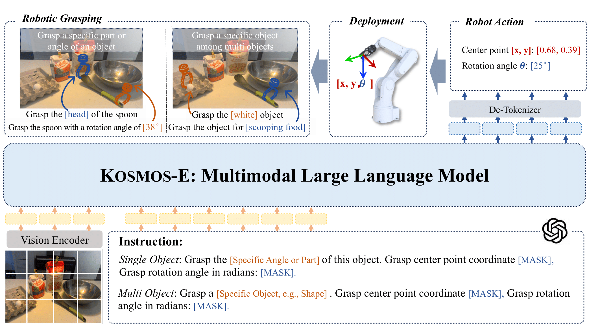
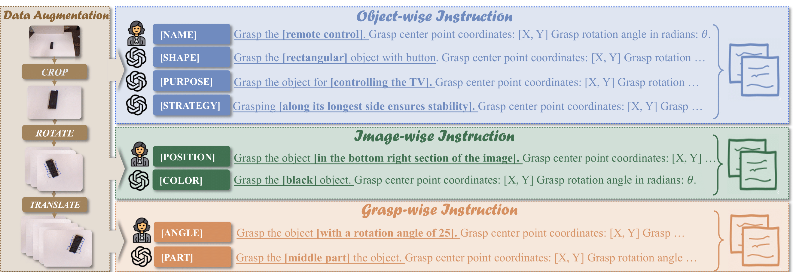
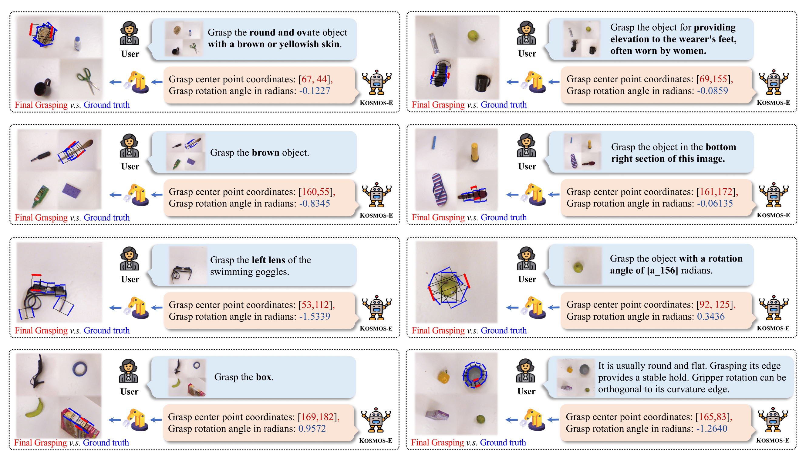

<!--
 * @Author: TX-Leo
 * @Mail: tx.leo.wz@gmail.com
 * @Date: 2024-03-11 00:57:06
 * @Version: v1
 * @File: 
 * @Brief: 
-->
# KOSMOS-E : Learning to Follow Instruction for Robotic Grasping
Code for paper "KOSMOS-E : Learning to Follow Instruction for Robotic Grasping" at IEEE International Conference on Intelligent Robots and System (IROS), 2024.

[[website]]() [[paper]](IROS2024_KOSMOS_E.pdf) [[video]](https://youtu.be/ZUHpsCZ5nXc)



## 1. Setup

```bash
git clone https://github.com/TX-Leo/kosmos-e.git
cd kosmos-e
bash vl_setup_xl.sh
```

## 2. Dataset

We create INSTRUCT-GRASP dataset based on Cornell Grasping Dataset. It includes three components: Non, Single and Multi with 8 kinds of intructions. It has 1.8 million grasping samples, with 250k unique language-image non-instruction samples and 1.56 million instruction-following samples. Among these instruction-following samples, 654k pertain to the single-object scene, while the remaining 654k relate to the multi-object scene. You can download the dataset [HERE](TODO) (coming soon).

<!-- ```bash
/mnt/msranlpintern/dataset/INSTRUCT-GRASP/
``` -->


The dataset structure:
-   INSTRUCT-GRASP
    -   INSTRUCT-GRASP-NON-SINGLE
        -   01-10
            -   pcdxxxx
                -   pcdxxxx\_xx\_xxgrasp\_xya\_encoded\_with\_instruction\_xxxxxxx.tsv
                -   pcdxxxx\_xx\_xxgrasp\_xya\_encoded.tsv
                -   pcdxxxx\_xx\_xxgrasp\_r.png
                -   pcdxxxx\_xx\_xxgrasp\_rgrasp.png
            -   else
                -   instructions.json
    -   INSTRUCT-GRASP-MULTI
        -   01-10
            -   pcdxxxx
                -   pcdxxxx\_xx\_xxgrasp\_xya\_encoded\_with\_instruction\_xxxxxxx.tsv
                -   pcdxxxx\_xx\_xxgrasp\_r.png
                -   pcdxxxx\_xx\_xxgrasp\_rgrasp.png
        -   else
            -   instructions.json
    -   dataloder
        -   dataloader_config
## 3. Checkpoint
The checkpoint can be downloaded from [HERE](TODO) (coming soon):
<!-- ```bash
/mnt/msranlpintern/dataset/INSTRUCT-GRASP/dataloader/01/
``` -->

## 4. Training
After downloading the dataset, you should change the --laion-data-dir to the config directory path and --save-dir to the directory path saving models, --tensorboard-logdir to the directory path saving tensorboard logs in run_train.sh.

```bash
bash local_mount.sh
bash vl_setup_xl.sh
bash run_train.sh
```

## 5. Evaluation
We evaluate our model KOSMOS-E on the INSTRUCT-GRASP Dataset.

```bash
cd ../evaluation
bash vl_setup.sh
```
You can modify evaluation parameters in \eval\eval_cornell.py, mainly focusing on:

-   dataset_path
-   dataloader_num
-   train_output_num
-   instruction_type (angle/part/name/color/shape/purpose/position/strategy)

```bash
bash run_eval_cornell.sh
```
### 5.1 Non-Instruction Grasping
We follow a cross-validation setup as in previous works and partition the datasets into 5 folds
|**Method**|**Modality**|**IW**|**OW**|
|-|-|-|-|
|GR-ConvNet|RGBD|97.70|96.60|
|GG-CNN2|RGBD|84|82|
|RT-Grasp(Numbers Only)|RGB+text|58.44±6.04|50.31±14.34|
|RT-Grasp(With Prompts)|RGB+text|69.15±11.00|67.44±9.99|
|**KOSMOS-E**|RGB+text|**85.19±0.27**|**72.63±4.91**|

### 5.2 Instruction-following Grasping
Our model was trained using a combination of non-instruction and instruction-following datasets. In contrast, four other baselines were each trained on a distinct dataset: non-instruction, single-object, multi-object, and a combination of single-object and multi-object datasets. We adopted image-wise grasp accuracy as our primary evaluation metric.

|                  | **Single Object** |          | **Multi Object** |           |           |             |              |              |
| ---------------- | ----------------- | -------- | ---------------- | --------- | --------- | ----------- | ------------ | ------------ |
|     **Model**    | **angle**         | **part** | **name**         | **color** | **shape** | **purpose** | **position** | **strategy** |
| **KOSMOS-E**    | 77.98             | 82.35    | 31.43            | 29.56     | 29.49     | 27.93       | 30.44        | 36.16        |
| **Non**          | 79.16             | 76.80    | 0.42             | 4.80      | 1.48      | 0.42        | 7.34         | 2.47         |
| **Single**       | 78.27             | 80.28    | 0.49             | 0.35      | 0.35      | 0.46        | 0.35         | 0.85         |
| **Multi**        | 7.49              | 8.20     | 25.99            | 25.32     | 24.82     | 23.87       | 25.14        | 27.22        |
| **Single+Multi** | 78.02             | 80.92    | 30.23            | 30.12     | 28.46     | 27.23       | 29.69        | 33.58        |

# 6. Examples
There are some instruction-following grasping examples which includes single-object examples and multi-object examples.
